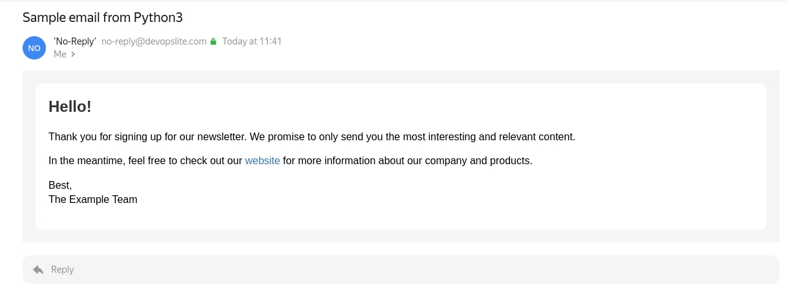

# Python3 script to send email to list

This script is used to send email to a list of email addresses.

## Table of contents

- [1. Features](#1-features)
- [2. Usage](#2-usage)
    - [Step 1: Change SMTP configuration](#step-1-change-smtp-configuration)
    - [Step 2: Change recipient list](#step-2-change-recipient-list)
    - [Step 3: Edit email content](#step-3-edit-email-content)
    - [Step 4: Change the Subject of the email](#step-4-change-the-subject-of-the-email)
    - [Step 5: Run the script](#step-5-run-the-script)
- [3. Result](#3-result)
- [4. Software version](#4-software-version)

## 1. Features

- Support declaring email account information used to send email through [config.ini](./config.ini) file. No need to edit the configuration line by line in the script.

- Declare a simple email list of recipients through the files [emails.txt](./emails.txt).

- Support sending email with HTML format and email content specified in [message.html](./message.html) file. This makes your emails look nicer and more informative, instead of sending a single line of text.

- Support logging to [email.log](./email.log) file so that you know the execution results of the script.

- Supports SMTP connection with both port 25, 465 and 587. Very suitable when you use with different SMTP servers.

## 2. Usage

### Step 1: Change SMTP configuration

Open the [config.ini](./config.ini) file and change the values to yours.

### Step 2: Change recipient list

Open the [emails.txt](./emails.txt) file and change it to your list of email recipients.

Some note:
- Each line in the file is an email address.
- There should be no extra spaces in the email address line.
- There should be no blank lines in the file.
- You should process the list before putting in this file.

### Step 3: Edit email content

Open file [message.html](./message.html) and edit the file content to the email you want to send. You will need to know a little bit of HTML and CSS to make changes here. Or you can use templates available on the internet or tools that support automatic HTML template generation.

### Step 4: Change the Subject of the email

You open file [send-email.py](./send-email.py), at line 80, you change the subject content of the email you want to send.

```python
...
    # Subject
    subject = "Sample email from Python3"
...
```

### Step 5: Run the script

Run the command below to send the email.

```sh
./send-email.py
```

## 3. Result

The log of the script should look like this, you can open the [email.log](./email.log) file and see.

```log
2023-01-29 11:41:31,148 INFO: Start sending email
2023-01-29 11:41:31,149 INFO: Reading SMTP configurations from config.ini
2023-01-29 11:41:31,149 INFO: Finished reading SMTP configurations
2023-01-29 11:41:37,095 INFO: Email sent to abc@devopslite.com
2023-01-29 11:41:41,405 INFO: Email sent to xyz@devopslite.com
2023-01-29 11:41:41,406 INFO: Finished sending email
```

Recipient email results.



## 4. Software version

| Software | Version |
|---|---|
| Python | 3.8.10 |
